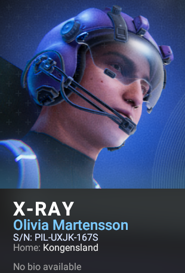
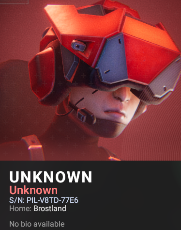

# PILOT SERIAL MOD

**RELEASE DATE:** 2025/12/14
<br>**MOD VERSION:** 1.5.0
<br>**MOD LINK (Github):** [GitHub Repository](https://github.com/miketanJp/pilotSerialNumberMod)<br>
<br>**PROGRAMMING LANGUAGE:** C-Sharp 7.3 (Framework v4.7.2)

---

## MOD INTRO




This mod introduces a unique serial number system for **Phantom Brigade**, a game by **Brace Yourself Games**.<br>
The mod hooks the UI using **Harmony Framework** by applying postfix patches to the methods ```CIViewBasePilotInfoExtended.RedrawForPilot``` and ```CIViewBaseEditor.OnEditStart```.
On each redraw or when the editor opens, a small UI label is injected under the pilot summary/bio using NGUI. This label shows the pilot serial in the form "S/N: <code>PIL-XXXX-XXXX</code>" without modifying the pilot's biography text or other stats.

Serials are generated once per pilot as two groups of 4 uppercase alphanumeric characters ([A-Z][0-9]):
```PIL-XXXX-XXXX```
Once a serial is generated, it is reused on subsequent openings of the view/editor and the cache YAML cannot be edited in-game.
Persistence uses a lightweight YAML cache stored per save. Only pilots belonging to the Phantoms faction are written to the cache; enemy pilot S/Ns are displayed in UI but are not persisted. Starter pilots with internal names `pb_pilot_01` … `pb_pilot_04` are ignored to avoid cross‑save collisions (these are 'pre-built' pilots provided in a new game). No changes are written into the pilot bio or the game's pilot YAML data.

In addition, there is no need to edit the bio to trigger generation; simply opening the pilot view or the customization screen is enough (as shown in the video above).

### KEY FEATURES

- **Unique serial number** automatically generated for every pilot.
- **Per-save YAML cache** for Phantoms pilots; enemies are UI-only and not persisted.
- Serial displayed as a dedicated **on-screen label** (the bio is not modified).
- Compatible with **Pilot editor view, standard pilot view, briefing view and pilot view in combat**.
- Safe: does not affect any other pilot stats or attributes.
- Safe to remove: the mod can be safely removed, significantly decreasing the chances to corrupt a save game.

---

## MOD AUTHOR

- .Miketan

## CREDITS

- Harmony Framework for the patching
- Phantom Brigade Modding System
- Brace Yourself Games for the awesome game!

---

## MOD STATUS

- **Steam Workshop:** 🟡  
  [Steam Workshop Link - TBA](#)
- **Nexus Mod:** 🟡  
  [Nexus Mod Link - TBA](#)

---

## INSTALLATION (EPIC GAME VERSION)

To install the mod:

1. Extract the mod folder into the following directory:
   <br>```[Drive]:\Users\[yourUser]\AppData\Local\PhantomBrigade\Mods```
   <br><br>
2. Launch the game; the mod will be automatically detected and activated.

> ⚠️ **[DISCLAIMER]** ⚠️
> <br>While the mod has been fully tested by covering most of the use cases, make sure to back up your save file before
> applying the mod to avoid any unintended (and negative) effects.
> <br><br>The mod author (.Miketan) will not be held responsible for any misuse of this mod or the damage can cause to
> saves corruption.
> <br>The above code project is made public to adhere
> with [Brace Yourself Games' guidelines](https://braceyourselfgames.com/mod-policy/)
> mostly to certify the present Library Code **DOES NOT CONTAIN** any malware and/or trojan in every form.
> <br><br>You are free to use my mod as a dependency to other mods as long as you ask me permission and giving
> credits to me, as this mod is also covered under **BSD-3 Licence**.

---

## CHANGELOG

- Phantom Brigade 2.0 Support
- Initial Release